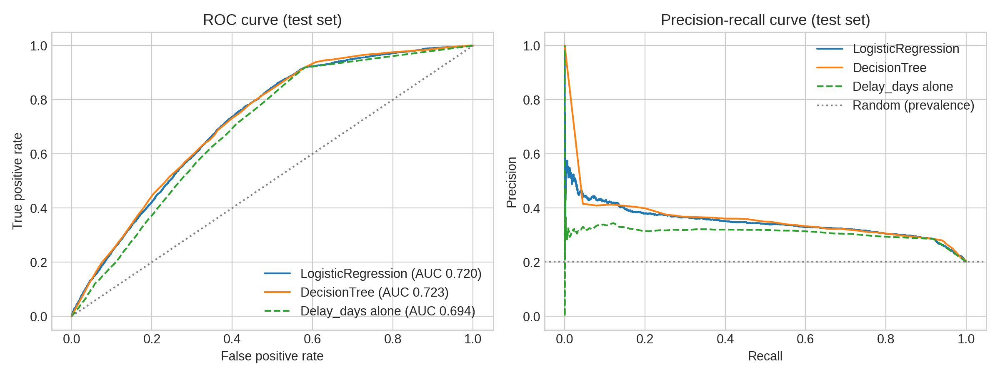
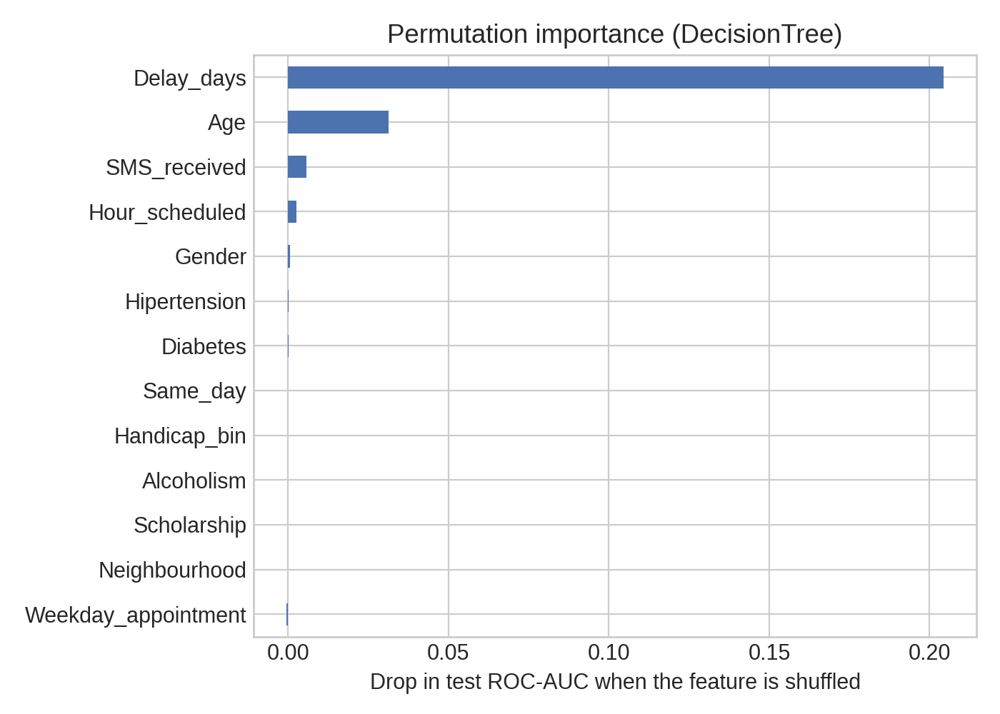

# no-show-predictor

Predicting medical appointment no-shows from information available when the appointment is scheduled, with an evaluation designed to avoid over-optimistic numbers: patient-grouped split, cross-validated model comparison, calibrated probabilities, a threshold chosen without touching the test set, and comparison with simple references.

-blue)  [](https://ferdioaivision-no-show-predictor.streamlit.app/)

Author: Kokouvi Ferdinand DJATA - GitHub: [@ferdioaivision](https://github.com/ferdioaivision) (Ferdio AI Vision). Tested with Python 3.12 and scikit-learn 1.9.0.

## 1. Data

Kaggle *Medical Appointment No Shows* (`KaggleV2-May-2016.csv`), one row per appointment, Brazil, 2016 (the source does not name the hospital or clinics). Check the dataset's terms of use on Kaggle before redistributing the raw file.

| Step | Rows |
|---|---|
| Raw file | 110,527 |
| Age < 0 or > 110 removed | 6 |
| Appointment date before scheduling date removed (impossible) | 5 |
| **Clean** | **110,516** (62,296 patients, 81 neighbourhoods, 20.19 % no-show) |

`Delay_days` is the number of **calendar days** between scheduling and appointment. The file stores the appointment as a date at 00:00 but the scheduling as a full timestamp, so a difference in fractional days would make every same-day appointment look negative. `Same_day` (delay = 0) is added because the no-show rate jumps from 4.6 % on the same day to 21.4 % one day ahead, a step a linear model cannot represent from `Delay_days` alone (test ROC-AUC 0.66 without it, 0.72 with it).

## 2. Method

- **Split by patient.** 39 % of patients have several appointments (1.77 per patient on average). With a plain random split, 59.8 % of the test appointments belong to a patient who is also in the training set. This leak is harmless for the logistic regression and the tree, but it inflates k-NN (ROC-AUC 0.703 on a random split vs 0.690 on a patient-grouped split, same k). The split here is stratified and grouped (`StratifiedGroupKFold`): 88,412 training and 22,104 test appointments, same no-show rate in both, no shared patient.
- **Model selection on cross-validation only**: patient-grouped 5-fold CV on the training set, ROC-AUC scoring. The test set is used once, for reporting.
- **No class weighting.** It leaves the ranking unchanged but pushes the predicted probabilities to about 0.44 on average for a 20 % base rate. Without it the mean prediction is 0.201 for an observed rate of 0.202 (calibration curve in `figures/calibration.png`).
- **Threshold chosen without the test set.** For a target recall, the threshold is the highest one reaching that recall on out-of-fold predictions of the training set; it is then evaluated once on the test set.
- **References that need no model**: ranking by `Delay_days` alone, and a random ranking.

## 3. Results (held-out patients)

| Model | Best parameters | CV ROC-AUC (+/- sd) | Test ROC-AUC | Test PR-AUC | Test Brier |
|---|---|---|---|---|---|
| LogisticRegression | C = 0.01 | 0.7213 (0.0036) | 0.7196 | 0.3478 | 0.1453 |
| **DecisionTree** (deployed) | depth 7, min leaf 1000 | 0.7256 (0.0038) | 0.7228 | 0.3436 | 0.1450 |
| KNN | k = 201 | 0.7221 (0.0025) | 0.7250 | 0.3510 | 0.1447 |
| `Delay_days` alone (no model) | - | - | 0.6943 | 0.3035 | - |
| Random ranking | - | - | 0.5000 | 0.2019 | - |

The three models are equivalent: their CV differences are smaller than the CV standard deviation. The decision tree is deployed because it is small and interpretable. The k-NN model is not saved (it stores the whole training set, about 70 MB). Its k grid had to be widened: with k up to 11 the k-NN looked clearly worse (0.70) than the other models, but AUC keeps improving with k. The tree's best `min_samples_leaf` is at the upper end of its grid, but the AUC differences between 300 and 1000 are below the CV standard deviation.

**Operating points of the deployed tree** (thresholds from training out-of-fold predictions, metrics on the test set; 20.2 % of appointments are no-shows):

| Target recall | Threshold | Test recall | Test precision | Appointments flagged |
|---|---|---|---|---|
| 0.50 | 0.285 | 0.516 | 0.348 | 29.9 % |
| **0.65 (default)** | **0.254** | **0.652** | **0.324** | **40.7 %** |
| 0.80 | 0.215 | 0.779 | 0.309 | 50.8 % |

Precision at the default operating point is 1.6 times the base rate. The model helps to prioritise reminder calls; it does not identify no-shows reliably.



## 4. What drives no-shows

- **Lead time dominates.** No-show rate by delay: same day 4.65 %, 1 day 21.35 %, 2-7 days 24.68 %, 8-15 days 30.80 %, 16-30 days 32.51 %, more than 30 days 33.00 %. Permutation importance (drop in test ROC-AUC): `Delay_days` 0.204, `Age` 0.031, `SMS_received` 0.006, `Hour_scheduled` 0.003; all other features are below 0.002 (`Scholarship` and `Neighbourhood` are at zero).
- **The delay does most of the work.** A tree using only the delay reaches ROC-AUC 0.695, delay plus age 0.719, the full model 0.723.
- **The SMS "paradox" is a lead-time effect.** Crude no-show rate is 16.7 % without SMS and 27.6 % with SMS, but SMS reminders are never sent for appointments booked 2 days ahead or less, and those have low no-show rates. At equal delay, recipients have a lower no-show rate: 23.8 % vs 26.6 % (3-7 days), 28.5 % vs 34.1 % (8-15), 29.7 % vs 36.8 % (16-30), 30.2 % vs 37.5 % (over 30). This is still an association from observational data, not proof of an effect.
- **Weak associations.** Cramer's V: same-day 0.283, SMS 0.127, hypertension 0.036, scholarship 0.029 (19.8 % vs 23.7 % no-show), weekday 0.016. Saturday has the highest rate (23.1 %) but only 39 appointments.



## 5. Structure

```
no-show-predictor/
├── data/       KaggleV2-May-2016.csv, model_comparison.csv, chi2_results.csv
├── figures/    EDA (01-04) and evaluation figures (roc_pr_curves, calibration, threshold_tradeoff, feature_importance)
├── models/     model_DecisionTree.joblib, model_LogisticRegression.joblib, metadata.json
├── notebooks/  EDA_and_Modeling.ipynb   (run from the notebooks/ folder)
├── src/        preprocessing.py, evaluation.py, train.py
├── app.py      Streamlit app
└── requirements.txt
```

## 6. How to run

```bash
pip install -r requirements.txt
python src/train.py          # about 10-15 minutes on one CPU (the k-NN grid is the slow part); writes models/, data/model_comparison.csv
streamlit run app.py
```

The saved models were produced with scikit-learn 1.9.0, which `requirements.txt` pins. If the saved file cannot be loaded (different version), the app refits the decision tree from the dataset with the stored parameters.

## 7. Limitations

- A single Brazilian dataset from 2016 with unidentified site(s). The split is by patient, not by date, so temporal drift is not evaluated; a hospital deployment needs local retraining and validation on future months.
- No history of previous no-shows, distance, provider or appointment reason. The patient id could provide the history (using past appointments only) and would be the first feature to try.
- Observational data: no causal claim about SMS reminders or any other feature.
- No fairness audit across neighbourhoods, age groups or scholarship status.
- Ranking quality is modest (ROC-AUC 0.72, PR-AUC 0.34 vs 0.20 at random). Use as decision support for prioritising reminder calls, never to refuse or cancel appointments.

## 8. License

MIT - Ferdio AI Vision - Kokouvi Ferdinand DJATA
